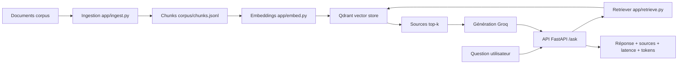

# Compte rendu - Projet A : AssistKB Search

> Template à copier dans `docs/COMPTE-RENDU.md` de votre dépôt et à remplir.

## 1. Présentation

- **Équipe** : BLAIN Antoine, PECONTAL Corentin, MARTIN Evan
- **Membres et rôles** :
  - PECONTAL Corentin – R1 Data / Ingestion
  - MARTIN Evan – R2 Embeddings / Index
  - BLAIN Antoine – R3 Retrieval / LLM
  - ___________ – R4 DevOps / Observabilité
- **Projet** : A - AssistKB Search (vector store Qdrant)

## 2. Objectif

Notre RAG est concu pour repondre au questionnement de nos utilisateur a partir de document public (DATA.GOUV). sont objectif est de fournir des reponse fiable et de dire si il n'a pas la connaisance ou les document.quand une question est posée par l'utilisateur le RAG recherche le passage le plus pertinant dans les document fournit, qu'il transmet a une IA (gemini), puis nous apporte une reponse base sur ces information.

## 3. Architecture



## 4. Fonctionnement

D’abord, les documents placés dans `corpus/raw` sont lus par `app/ingest.py`. Le script extrait le texte des fichiers compatibles comme les PDF, CSV, TXT, puis découpe ce texte en chunks de taille fixe. Ces chunks sont ensuite sauvegardés dans `corpus/chunks.jsonl`.

Ensuite, `app/embed.py` charge les chunks et utilise le modèle `sentence-transformers/all-MiniLM-L6-v2` pour créer un embedding pour chaque passage. Les vecteurs sont normalisés puis envoyés dans Qdrant avec leurs métadonnées, comme la source du document et la position du chunk.

Quand l’utilisateur interroge l’API avec `/ask`, `app/api.py` valide la question et le paramètre `top_k`. La question est envoyée au retriever, qui calcule son embedding et recherche dans Qdrant les passages les plus similaires.

Les résultats sont filtrés avec un seuil de similarité de `0.35`. Si aucun passage pertinent n’est trouvé, le système retourne une réponse de refus. Sinon, les passages sélectionnés sont envoyés à `app/generate.py`, qui construit un prompt strict et demande à Groq de répondre uniquement à partir des sources fournies.

La réponse finale contient la réponse générée, les sources utilisées, la latence en millisecondes, ainsi que le nombre de tokens en entrée et en sortie.

## 5. Structure du projet

> Arborescence commentée : quel fichier fait quoi.

```text
.
├── app/
│   ├── ingest.py              # Extraction du texte et découpage en chunks
│   ├── embed.py               # Génération des embeddings et indexation
│   ├── retrieve.py            # Recherche top-k dans Qdrant
│   ├── generate.py            # Génération de réponse avec Groq
│   ├── store.py               # Connexion et opérations avec Qdrant
│   └── api.py                 # API FastAPI avec /ask et /health
│
├──corpus/
│   ├── raw/              # documents sources récupérés
│   ├── seed/             # documents de départ
│   └── chunks.jsonl      # chunks générés
│
├── docs/
│   └── COMPTE-RENDU.md        # Compte rendu du projet
│
├── scripts/
│   └── fetch_corpus.ps1       # Récupération du corpus sous Windows
│
├── .env.example               # Exemple de variables d'environnement
├── .gitignore                 # Fichiers et dossiers ignorés par Git
├── pyproject.toml             # Dépendances Python du projet
├── docker-compose.yml         # Lancement des services
└── README.md                  # Documentation general du projet
```

---

## 6. Choix techniques (le pourquoi)

| Choix | Valeur retenue | Justification |
|---|---|---|
| Modèle embeddings | `all-MiniLM-L6-v2` | Modèle léger, rapide et adapté à la recherche sémantique. |
| Vector store | Qdrant | Base vectorielle simple à utiliser, performante et compatible Docker. |
| Distance | Cosine | Coherente avec les vecteurs normalises |
| chunk_size / overlap | 800 / 120 | Les chunks de 800 caractères pour le contexte, et l’overlap de 120 limite la perte d’information |
| top_k | entre 1 et 20 | avoir le choix avec 5 par default |
| seuil de refus | 0,35 | en dessous de ce score le passage est ignorer, pour toujour avoir une source pertinante |
| LLM | GROQ | GEMINI etant payant nous somme partie sur un choix |

---

## 7. Résultats / métriques

| Métrique | Valeur | Commentaire |
|---|---:|---|
| Score similarité moyen (top-k) | NON PRECISER | on ne retien pas les passage avec un score en dessous de 0,35 |
| Taux de refus (questions hors corpus) |  | le systeme ne repond pas si il ne trouve pas de source pertinante |
| Latence p50 / p95 | 480 / 955 ms | moyenne sur 10 requette |
| Tokens moyens (prompt + completion) | environs 1200 token | FinOps |
| Coût projeté "si payé" / 1000 questions | 0,30 USD pour GPT OSS 20B 128k | Cf. `app/metrics.py` |


---

## 8. Difficultés et limites

Au départ, nous avions choisi Gemini pour la génération des réponses, car nous pensions que ce serait gratuite. Finalement, ce  n’était pas la cas, et nous avons basculer vers Groq. Cette transition a demandé des ajustements au niveau de la clé API, du modèle et du code de génération.

Nous avons aussi eu des problèmes liés au temps de lancement, notamment à cause du chargement du modèle ( 20 minute a chaque docker up ). La connexion entre l’interface HTML et l’API FastAPI a également été compliquée.

pour les amelioration, il faudrait intégrer davantage de formats de fichiers, permettre l’utilisation d’un corpus plus large, améliorer la propreté des réponses générées et citer les sources de manière plus claire, sans afficher trop de détails techniques.

---

## 9. Bonus - Évaluation : golden dataset

 10 questions de reference avec la source attendue. recall@k mesure.
 ---

## 10. Bonus - Reranking

> Effet du cross-encoder sur la pertinence (avant/apres).
---


## 11. Bonus - Pistes d'amélioration

> Recherche hybride (BM25 + vectoriel), optimisation cout/latence, etc.