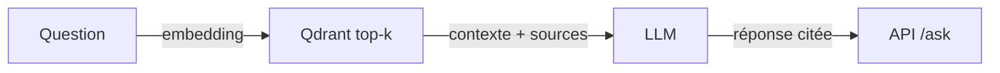

# Compte rendu - Projet A : AssistKB Search

> Template à copier dans `docs/COMPTE-RENDU.md` de votre dépôt et à remplir.

## 1. Présentation

- **Équipe** : BLAIN Antoine, PECONTAL Corentin, MARTIN Evan
- **Membres et rôles** :
  - PECONTAL Corentin – R1 Data / Ingestion
  - MARTIN Evan – R2 Embeddings / Index
  - BLAIN Antoine – R3 Retrieval / LLM
  - ___________ – R4 DevOps / Observabilité
- **Projet** : A - AssistKB Search (vector store Qdrant)

## 2. Objectif

Notre RAG est concu pour repondre au questionnement de nos utilisateur a partir de document public (DATA.GOUV). sont objectif est de fournir des reponse fiable et de dire si il n'a pas la connaisance ou les document.quand une question est posée par l'utilisateur le RAG recherche le passage le plus pertinant dans les document fournit, qu'il transmet a une IA (gemini), puis nous apporte une reponse base sur ces information.

## 3. Architecture



## 4. Fonctionnement

Décrire le parcours complet d'une question.

## 5. Structure du projet

> Arborescence commentée : quel fichier fait quoi.

```text
.
├── app/
│   ├── api.py                 # API FastAPI et route /ask
│   ├── rag.py                 # Logique principale du RAG
│   ├── embeddings.py          # Génération des embeddings
│   ├── qdrant_client.py       # Connexion et requêtes vers Qdrant
│   ├── metrics.py             # Mesures de latence, tokens et coûts
│   └── utils.py               # Fonctions utilitaires
│
├── data/
│   ├── raw/                   # Documents sources
│   ├── processed/             # Documents nettoyés
│   └── chunks/                # Passages découpés
│
├── docs/
│   └── COMPTE-RENDU.md        # Compte rendu du projet
│
├── tests/
│   └── test_rag.py            # Tests du pipeline RAG
│
├── requirements.txt           # Dépendances Python
├── docker-compose.yml         # Lancement des services
└── README.md                  # Documentation du projet
```

---

## 6. Choix techniques (le pourquoi)

| Choix | Valeur retenue | Justification |
|---|---|---|
| Modèle embeddings | `all-MiniLM-L6-v2` | Modèle léger, rapide et adapté à la recherche sémantique. |
| Vector store | Qdrant | Base vectorielle simple à utiliser, performante et compatible Docker. |
| Distance | Cosine | Coherente avec les vecteurs normalises |
| chunk_size / overlap | ___ / ___ | ___________ |
| top_k | _____ | ___________ |
| seuil de refus | _____ | ___________ |
| LLM | GEMINI | Deja un compte, rapide, Facile d'utilisation |

---

## 7. Résultats / métriques

| Métrique | Valeur | Commentaire |
|---|---:|---|
| Score similarité moyen (top-k) | _____ | Qualité du retrieval |
| Taux de refus (questions hors corpus) | _____ % | Doit être élevé sur le lot hors-corpus |
| Latence p50 / p95 | ___ / ___ ms | Exploitation |
| Tokens moyens (prompt + completion) | _____ | FinOps |
| Coût projeté "si payé" / 1000 questions | _____ USD | Cf. `app/metrics.py` |


---

## 8. Difficultés et limites

Ce qui n'a pas marche, ce que vous feriez avec plus de temps.

---

## 9. Bonus - Évaluation : golden dataset

 10 questions de reference avec la source attendue. recall@k mesure.
 ---

## 10. Bonus - Reranking

> Effet du cross-encoder sur la pertinence (avant/apres).
---


## 11. Bonus - Pistes d'amélioration

> Recherche hybride (BM25 + vectoriel), optimisation cout/latence, etc.